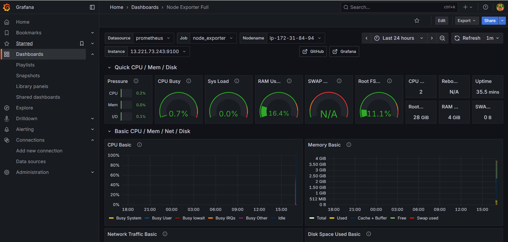

# DevOps Project: Microservices Application Deployment

## Project Overview

This project demonstrates a robust CI/CD pipeline for deploying a microservices application using a comprehensive set of modern DevOps tools and practices. The workflow covers everything from code commit to deployment, monitoring, and GitOps-driven continuous delivery.

**Key Components:**

* **Jenkins:** Orchestrates the CI/CD pipeline, automating the build, push, and deployment phases.
* **Docker & Docker Hub:** Used for containerizing the application and managing container images.
* **AWS EKS:** Provides a managed Kubernetes cluster for scalable and resilient application deployment.
* **NGINX Ingress Controller:** Manages external access to the services within the Kubernetes cluster.
* **Prometheus & Grafana:** Implement robust monitoring, collecting metrics from the EKS cluster and Jenkins, and visualizing them through intuitive dashboards.
* **ArgoCD:** Enables GitOps, ensuring the cluster state automatically converges with the configuration defined in the Git repository.

## Pipeline Flow

1.  **Code Checkout:** Jenkins fetches the latest code from GitHub.
2.  **Build & Tag:** A Docker image of the microservice is built and tagged with the Jenkins build number and `latest`.
3.  **Push to Docker Hub:** The built Docker image is pushed to your Docker Hub repository.
4.  **AWS & Kubernetes Setup:** Jenkins configures AWS CLI and `kubectl` to interact with your EKS cluster.
5.  **Deployment to Kubernetes:** The application's Kubernetes Deployment and Service are applied to the EKS cluster, dynamically updating the image tag.
6.  **Ingress Deployment:** An Ingress resource is deployed to expose the application via the NGINX Ingress Controller.
7.  **URL Retrieval & Health Checks:** The Ingress URL is retrieved, and basic health checks are performed to ensure the application is accessible.
8.  **Monitoring:** Prometheus scrapes metrics from the EKS nodes (via Node Exporter) and Jenkins. Grafana visualizes these metrics using pre-built dashboards.
9.  **GitOps (ArgoCD):** ArgoCD is deployed to the EKS cluster to manage continuous deployment directly from Git, maintaining desired state reconciliation.

## Setup Steps (High-Level)

1.  **Basic Infrastructure:**
    * Push project code to your GitHub repository.
    * Launch an AWS EC2 instance (`Ingress-Server`) for Jenkins, with necessary security group ports open.
2.  **Tooling Installation:**
    * Install Jenkins and Docker on the `Ingress-Server` VM.
    * Configure Jenkins plugins (Docker, AWS, Kubernetes, Prometheus) and credentials (Docker Hub, AWS IAM).
3.  **EKS Cluster Creation:**
    * Create an AWS IAM user with required EKS permissions.
    * Install AWS CLI, `kubectl`, and `eksctl` on the `Ingress-Server`.
    * Create the EKS cluster using `eksctl`.
    * Deploy the NGINX Ingress Controller to your EKS cluster.
4.  **Jenkins Job Configuration:**
    * Create a Jenkins Pipeline job pointing to your GitHub repository's `Jenkinsfile`.
5.  **Monitoring Setup:**
    * Launch a separate AWS EC2 instance (`Monitoring Server`).
    * Install and configure Prometheus and Node Exporter on the `Monitoring Server`.
    * Install Grafana on the `Monitoring Server` and configure Prometheus as its data source, then import Node Exporter and Jenkins dashboards.
6.  **ArgoCD Deployment:**
    * Install Helm on the `Ingress-Server`.
    * Deploy ArgoCD to your EKS cluster using Helm.
    * Expose ArgoCD via a LoadBalancer service and retrieve its initial admin password.

This project provides a robust foundation for automated deployments and real-time monitoring of microservices on Kubernetes.

---

## Prometheus and Grafana Dashboard Results

After successfully setting up Prometheus and importing the Node Exporter and Jenkins dashboards into Grafana, you can visualize key metrics related to your infrastructure and CI/CD pipeline.

### Jenkins: Performance and Health Overview

This dashboard provides insights into your Jenkins server's health, job execution, and resource utilization.

**Screenshot:**

**Key Observations:**
* **Job Metrics:** Shows 0 processing speed, 0 queued rate, and 0 Jenkins queue size, indicating no current active jobs or a clear queue.
* **Job History:** Records 1 successful job and 2 failed jobs, with no data for aborted or unstable jobs.
* **Resource Usage:** Memory usage is around 443 MB, and CPU usage is very low at 0.00404%.
* **Health:** Jenkins health is at a solid 1.0 (healthy).
* **Nodes:** No Jenkins nodes are offline.

### Node Exporter Full Dashboard

This dashboard offers a comprehensive view of the underlying EC2 instance (Monitoring Server) where Node Exporter is running, providing system-level metrics.

**Screenshot:**

**Key Observations:**
* **CPU Usage:** Very low CPU utilization, with basic usage at 0.2% User, 0.7% Busy, and 0.0% System Load.
* **Memory Usage:** Shows 16.4% RAM used, utilizing approximately 2 GB out of 4 GB available.
* **Disk Usage:** Root file system usage is at 11.1%.
* **Uptime:** The Node Exporter has been running for approximately 35.5 minutes.
* **Instance Details:** The dashboard is monitoring the instance `13.221.73.243:9100`, confirming the Node Exporter target is correctly configured in Prometheus.

These dashboard confirm that Prometheus is successfully scraping data from both Jenkins and the Node Exporter, and Grafana is effectively visualizing this data, providing crucial insights into your system's performance and health.

---

